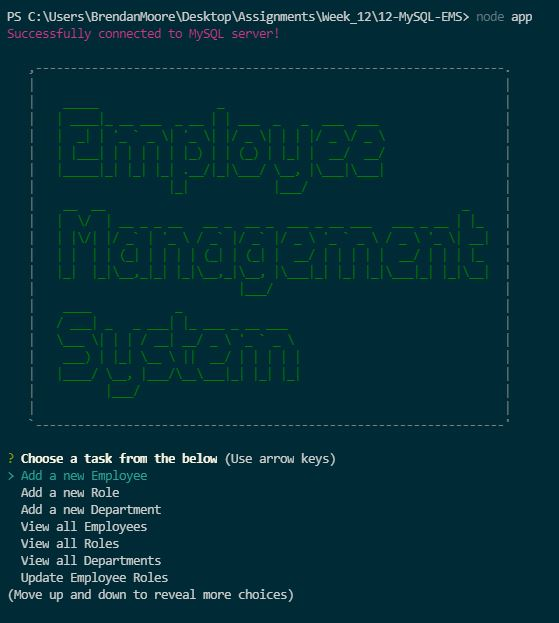
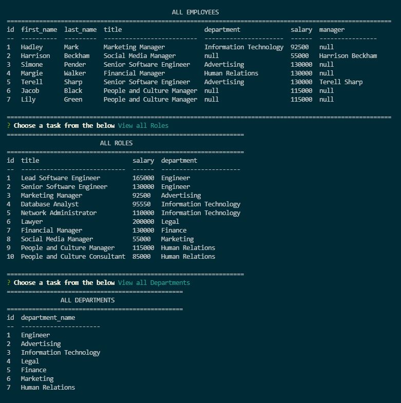
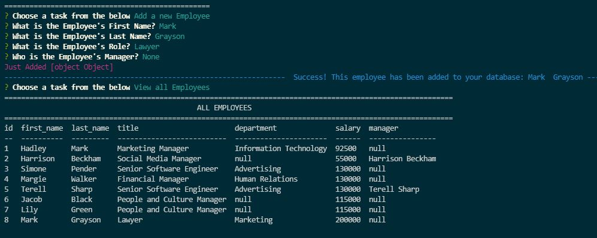
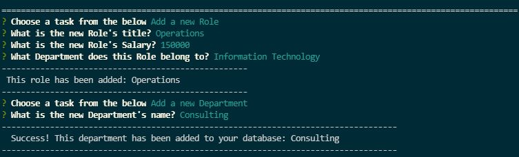
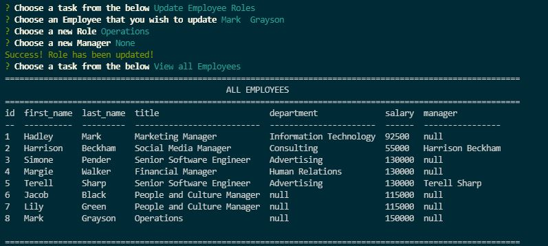
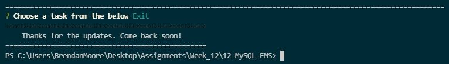

# Employee Management System

  

  ## Table of Contents
  - [Description](#description)
  - [Installation](#installation)
  - [Usage Information](#usage-information)
  - [License](#license)
  - [Contribution Guidelines](#contribution-guidelines)
  - [Test Procedure](#test-procedure)
  - [Questions](#questions)
  - [Images](#images)

  ## Description
  Building an Employee Management System, otherwise known as Content Management Systems, that manages a company's employees using node.js, inquirer and MySQL.

  [Video of the Interface in Use](https://drive.google.com/file/d/1el35Jm4F5LCEQl_FMf3yvACT3so0k_8d/view?usp=sharing)

  The database is designed to contain the following three tables:

* **department**:

  * **id** - INT PRIMARY KEY
  * **name** - VARCHAR(30) to hold department name

* **role**:

  * **id** - INT PRIMARY KEY
  * **title** -  VARCHAR(30) to hold role title
  * **salary** -  DECIMAL to hold role salary
  * **department_id** -  INT to hold reference to department role belongs to

* **employee**:

  * **id** - INT PRIMARY KEY
  * **first_name** - VARCHAR(30) to hold employee first name
  * **last_name** - VARCHAR(30) to hold employee last name
  * **role_id** - INT to hold reference to role employee has
  * **manager_id** - INT to hold reference to another employee that manages the employee being Created. This field may be null if the employee has no manager

  ## Installation
  npm install the following packages: mysql, inquirer, util, console.table, asciiart-logo, chalk

  ## Usage Information
  Use this interface to build detailed Content Management Systems for your company. It will help keep track of employees, employee roles, salaries, employee's managers and the departments the employees work in

  ## License
  MIT

  ## Contribution Guidelines
  Contribute freely

  ## Test Procedure
  n/a

  ## Questions
  If you have any questions, then feel free to contact me on the below:
  - Github: [bdjm94](https://github.com/bdjm94)
  - Email: [brendandjmoore@gmail.com](brendandjmoore@gmail.com)

    ## Images

  | EMS Home Page |
|------------|
  

  | Table View |
|------------|
  

  | New Employee |
|------------|
  

  | New Role & Department |
|------------|
  

  | Role Update |
|------------|
  

  | Exit Message |
|------------|
  

